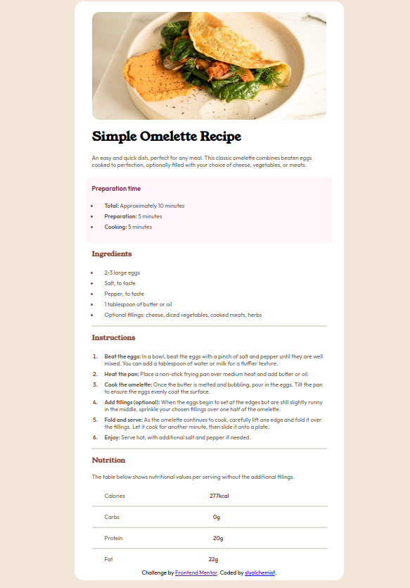

# Frontend Mentor - Recipe page solution

This is a solution to the [Recipe page challenge on Frontend Mentor](https://www.frontendmentor.io/challenges/recipe-page-KiTsR8QQKm). Frontend Mentor challenges help you improve your coding skills by building realistic projects. 

## Table of contents

- [Overview](#overview)
  - [The challenge](#the-challenge)
  - [Screenshot](#screenshot)
  - [Links](#links)
- [My process](#my-process)
  - [Built with](#built-with)
  - [What I learned](#what-i-learned)
  - [Continued development](#continued-development)
  - [Useful resources](#useful-resources)
- [Author](#author)
- [Acknowledgments](#acknowledgments)

**Note: Delete this note and update the table of contents based on what sections you keep.**

## Overview

### Screenshot

### Links

- Solution URL: [Add solution URL here](https://your-solution-url.com)
- Live Site URL: [Add live site URL here](https://your-live-site-url.com)

## My process
- For this code, I began by establishing the basic structure of the webpage via the HTML source. 
- Once I was satisfied with the basic structure, I began styling to make my webpage similar to the final outcome. 
- As I was going back and forth between the HTML and CSS files I kept finding smaller things I needed to tweak to get a close as possible to the objective. 

### Built with

- Semantic HTML5 markup
- CSS custom properties
- Flexbox
- CSS Grid
- Mobile-first workflow

### What I learned

- I improved my skills with the flexbox and overall styling with CSS. There weren't many issues I faced with this project. 

### Continued development

- I would like to keep getting more comfortable with the flexbox as it is a priceless tool.

- I would also like to continue improving my skills with styling with CSS. 

### Useful resources

- I didn't quite refer to any resources with this project! It was mostly just refining skills I already had. 

## Author

- Sammantha Vranken

